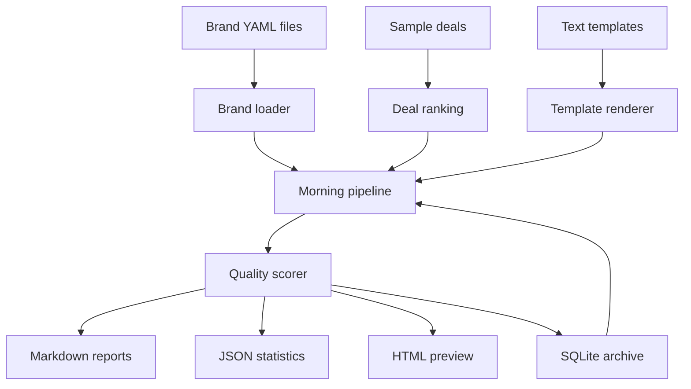

# Morning Content Engine

Private offline Python terminal app for generating daily social content packages across many deal brands.

V2 turns the original single-purpose deal script into a reusable content platform. Brands, platforms, schedules, hashtags, and templates are configuration driven, so adding a new website does not require code changes.

## Setup

```bash
python3 -m venv .venv
source .venv/bin/activate
pip install -r requirements.txt
```

## Commands

Run the V2 morning pipeline:

```bash
python main.py morning
```

List configured brands:

```bash
python main.py brands
```

Show recent archived posts:

```bash
python main.py history
```

Show latest statistics:

```bash
python main.py stats
```

Show the latest summary report:

```bash
python main.py report
```

The original V1 deal package commands still exist:

```bash
python main.py generate
python main.py top
python main.py clean
```

## Architecture



## Brand Configs

Brand files live in:

```text
config/brands/
```

Each `.yaml` file defines:

- `name`
- `description`
- `tone`
- `emoji_style`
- `hashtags`
- `social_platforms`
- `website`
- `logo_path`
- `affiliate_disclosure`
- `posting_schedule`

The engine automatically loads every `.yaml` and `.yml` file in that folder.

## Adding A New Website

Create a new YAML file:

```text
config/brands/my_new_site.yaml
```

Use the existing files as examples. Set the brand name, website, hashtags, social platforms, and morning schedule. No Python changes are needed.

## Templates

Templates live in:

```text
templates/<content_type>/*.txt
```

Supported content types include:

- `deal_post`
- `tip_post`
- `quote`
- `question`
- `did_you_know`
- `weekend_roundup`
- `trending`
- `affiliate_highlight`
- `newsletter_teaser`

Templates use variables:

```text
{{title}}
{{city}}
{{price}}
{{discount}}
{{emoji}}
{{cta}}
{{hashtags}}
{{brand}}
```

Add multiple `.txt` files inside a content type folder to create wording variations.

## Reports

The V2 morning pipeline writes reports to:

```text
reports/YYYY-MM-DD/
```

Generated files:

- `instagram.md`
- `facebook.md`
- `linkedin.md`
- `twitter.md`
- `newsletter.md`
- `summary.md`
- `preview.html`
- `statistics.json`
- `posts.json`

## Archive

Every generated post is saved to SQLite:

```text
data/content_archive.sqlite3
```

The archive stores date, brand, platform, content, hashtags, score, template used, and content type. It is also used to avoid generating identical content twice.

## Tests

```bash
python -m unittest discover
```

