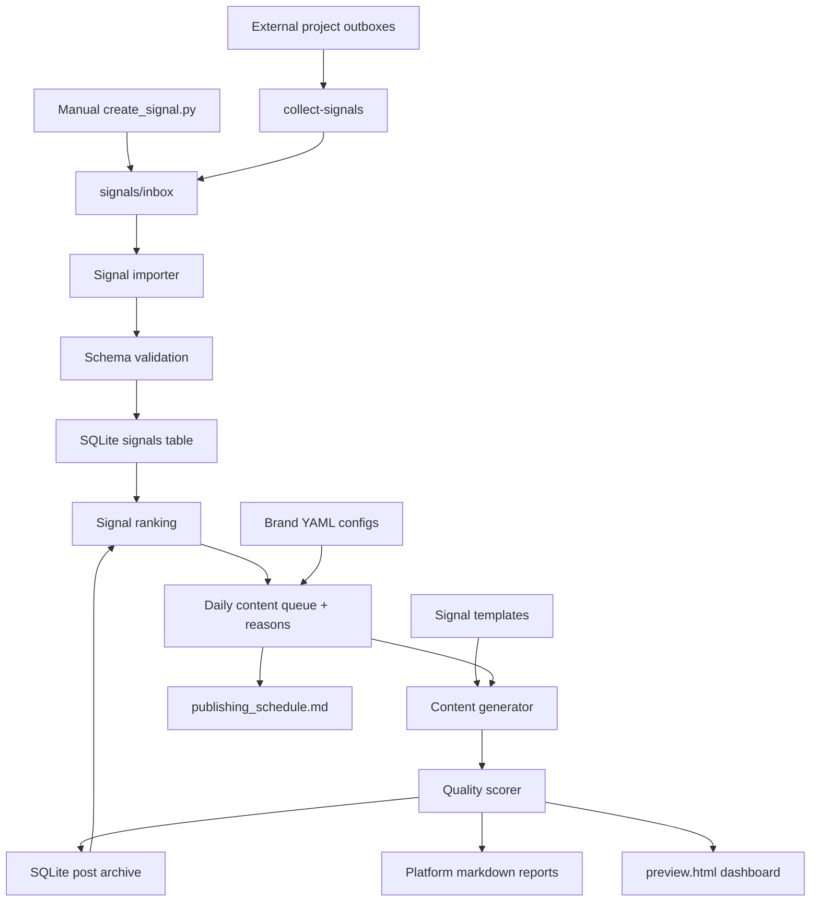

# Morning Content Engine

Private offline Python terminal app for turning project signals into a daily reviewable content queue.

V4 makes the engine easier for other projects to feed. Any project can export JSON signals to an outbox, and this app can collect, validate, queue, and transform those signals into platform content for manual review. It does not auto-post.

## Setup

```bash
python3 -m venv .venv
source .venv/bin/activate
pip install -r requirements.txt
```

## Commands

```bash
python main.py collect-signals
python main.py import-signals
python main.py signals
python main.py signals florida-deals
python main.py signals --today
python main.py signals --high-priority
python main.py queue
python main.py queue --limit 10
python main.py queue --brand "Bend Score"
python main.py queue --source bend-score
python main.py morning
python main.py report
python main.py stats
python main.py preview
```

Still supported:

```bash
python main.py brands
python main.py history
python main.py generate
python main.py top
python main.py clean
```

## Architecture



## Signal Contract

The formal contract is documented in:

```text
docs/SIGNAL_CONTRACT.md
```

Required fields:

- `source_project`
- `source_type`
- `brand`
- `title`
- `summary`
- `category`
- `priority`
- `confidence`

`url` is recommended for publishable signals and must be a valid `http` or `https` URL when present. The validator also normalizes tags, metadata, `created_at`, and generated ids.

## Manual Signal Creation

Create a signal from the terminal:

```bash
python tools/create_signal.py \
  --source-project florida-deals \
  --source-type deal \
  --brand "Florida Deals" \
  --title "Orlando hotel deal under $150" \
  --summary "Strong hotel deal for Florida travelers" \
  --url "https://hoteldealsflorida.org" \
  --category hotels \
  --priority 8 \
  --confidence 90
```

This writes a timestamped JSON file to:

```text
signals/inbox/
```

## Project Outbox Collection

External projects should write JSON files to their own `signals/outbox/` folder. Configure enabled sources in:

```text
config/signal_sources.yaml
```

Then run:

```bash
python main.py collect-signals
```

Missing folders produce warnings and do not stop the run. Duplicate files are skipped.

## Signal Intake Lifecycle

Drop JSON files into:

```text
signals/inbox/
```

Run:

```bash
python main.py import-signals
```

Valid files move to `signals/processed/`. Invalid files move to `signals/archive/errors/`.
Duplicate-only files move to `signals/archive/duplicates/`.

Example signal files live in:

```text
examples/signals/
```

## Signal Model

Each signal includes:

- `id`
- `source_project`
- `source_type`
- `brand`
- `title`
- `summary`
- `description`
- `url`
- `affiliate_url`
- `category`
- `tags`
- `priority`
- `confidence`
- `expiration`
- `image_prompt`
- `metadata`
- `created_at`

## Daily Queue

Run:

```bash
python main.py queue
```

Queue behavior is configured in:

```text
config/queue.yaml
```

The queue ranks recent signals by priority, confidence, expiration, brand schedule fit, platform fit, source/category diversity, and recent duplicate history. Each queued item includes a reason explaining why it was selected. It assigns signals to review platforms:

- Instagram
- Facebook
- Newsletter
- Blog
- Twitter/X
- LinkedIn

Queue entries are stored in SQLite.

Useful queue previews:

```bash
python main.py queue --limit 10
python main.py queue --brand "Bend Score"
python main.py queue --source bend-score
```

## Morning Pipeline

Run:

```bash
python main.py morning
```

Pipeline:

1. Load brands.
2. Load templates.
3. Import pending inbox signals.
4. Rank signals.
5. Create the daily content queue.
6. Generate platform content.
7. Generate preview dashboard.
8. Archive generated content.
9. Generate statistics.

## Reports

Reports are written to:

```text
reports/YYYY-MM-DD/
```

Generated files include:

- `instagram.md`
- `facebook.md`
- `linkedin.md`
- `twitter.md`
- `newsletter.md`
- `blog.md`
- `summary.md`
- `publishing_schedule.md`
- `preview.html`
- `statistics.json`
- `posts.json`
- `queue.json`

`summary.md` includes signal intake counts, duplicate/error counts, sources used, and queue reasons. `preview.html` shows top signals, queued posts, source project, confidence, CTA, links, hashtags, quality scores, and queue reason.

## Templates

Templates live in:

```text
templates/<content_type>/*.txt
```

Signal-aware variables:

```text
{{title}}
{{summary}}
{{description}}
{{brand}}
{{category}}
{{url}}
{{affiliate_url}}
{{confidence}}
{{priority}}
{{cta}}
{{hashtags}}
```

Add multiple `.txt` files inside a content type folder to create wording variations.

## Brand Configs

Brand files live in:

```text
config/brands/
```

The engine automatically loads every `.yaml` and `.yml` file. Adding a new website requires a new brand config and no Python changes.

## Duplicate Protection

The archive tracks:

- signal id
- title
- URL
- generated content hash
- date used

Recently used signals are skipped or ranked lower so the daily queue does not repeat the same content.

## Example Daily Workflow

```bash
python tools/create_signal.py --source-project florida-deals --source-type deal --brand "Florida Deals" --title "Orlando hotel deal under $150" --summary "Strong hotel deal for Florida travelers" --url "https://hoteldealsflorida.org" --category hotels --priority 8 --confidence 90
python main.py collect-signals
python main.py morning
open reports/$(date +%F)/preview.html
```

## Tests

```bash
python -m unittest discover
```
