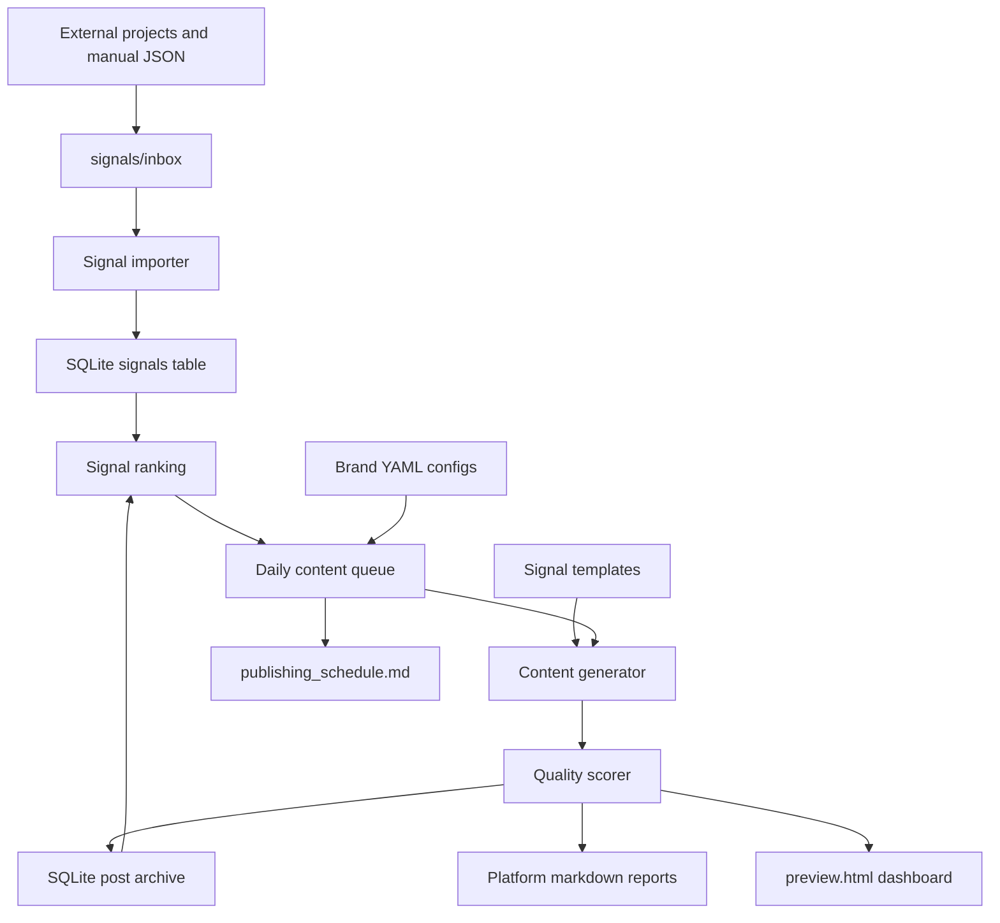

# Morning Content Engine

Private offline Python terminal app for turning project signals into a daily reviewable content queue.

V3 makes the engine signal-driven. Any project can drop JSON into `signals/inbox/`, and the app will validate the signals, store them in SQLite, rank them, create a daily publishing queue, generate platform copy, and write reports for manual review. It does not auto-post.

## Setup

```bash
python3 -m venv .venv
source .venv/bin/activate
pip install -r requirements.txt
```

## Commands

```bash
python main.py import-signals
python main.py signals
python main.py queue
python main.py morning
python main.py report
python main.py stats
python main.py preview
```

Still supported:

```bash
python main.py brands
python main.py history
python main.py generate
python main.py top
python main.py clean
```

## Architecture



## Signal Intake

Drop JSON files into:

```text
signals/inbox/
```

Run:

```bash
python main.py import-signals
```

Valid files move to `signals/processed/`. Invalid files move to `signals/archive/errors/`.

Example signal files live in:

```text
examples/signals/
```

## Signal Model

Each signal includes:

- `id`
- `source_project`
- `source_type`
- `brand`
- `title`
- `summary`
- `description`
- `url`
- `affiliate_url`
- `category`
- `tags`
- `priority`
- `confidence`
- `expiration`
- `image_prompt`
- `metadata`
- `created_at`

## Daily Queue

Run:

```bash
python main.py queue
```

The queue ranks recent signals by priority, confidence, expiration, brand fit, and duplicate history. It assigns signals to review platforms:

- Instagram
- Facebook
- Newsletter
- Blog
- Twitter/X
- LinkedIn

Queue entries are stored in SQLite.

## Morning Pipeline

Run:

```bash
python main.py morning
```

Pipeline:

1. Load brands.
2. Load templates.
3. Import pending inbox signals.
4. Rank signals.
5. Create the daily content queue.
6. Generate platform content.
7. Generate preview dashboard.
8. Archive generated content.
9. Generate statistics.

## Reports

Reports are written to:

```text
reports/YYYY-MM-DD/
```

Generated files include:

- `instagram.md`
- `facebook.md`
- `linkedin.md`
- `twitter.md`
- `newsletter.md`
- `blog.md`
- `summary.md`
- `publishing_schedule.md`
- `preview.html`
- `statistics.json`
- `posts.json`
- `queue.json`

## Templates

Templates live in:

```text
templates/<content_type>/*.txt
```

Signal-aware variables:

```text
{{title}}
{{summary}}
{{description}}
{{brand}}
{{category}}
{{url}}
{{affiliate_url}}
{{confidence}}
{{priority}}
{{cta}}
{{hashtags}}
```

Add multiple `.txt` files inside a content type folder to create wording variations.

## Brand Configs

Brand files live in:

```text
config/brands/
```

The engine automatically loads every `.yaml` and `.yml` file. Adding a new website requires a new brand config and no Python changes.

## Duplicate Protection

The archive tracks:

- signal id
- title
- URL
- generated content hash
- date used

Recently used signals are skipped or ranked lower so the daily queue does not repeat the same content.

## Tests

```bash
python -m unittest discover
```

